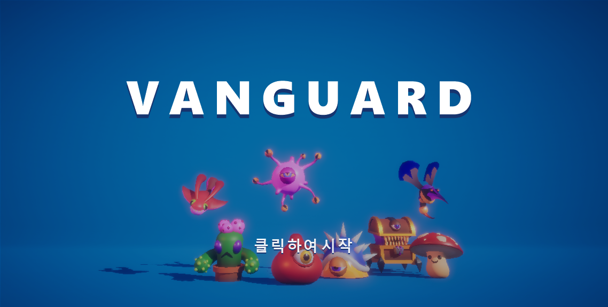
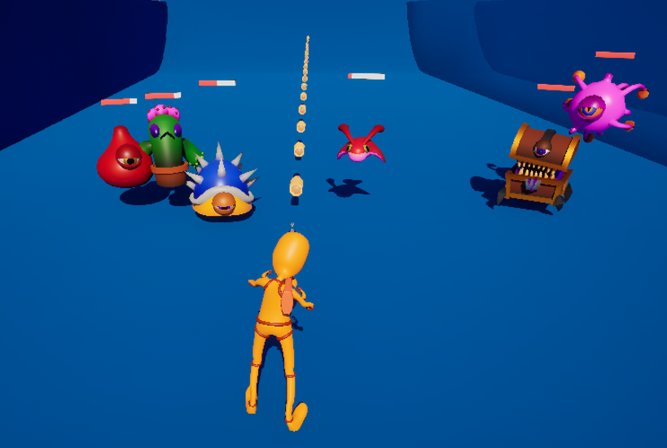

# Vanguard

> 좌우로만 움직이며 밀려오는 적을 막아내는 **레인 기반 오토슈터**




---

## 게임 소개

플레이어는 하나의 레인 위에서 **좌우로만** 이동합니다. 전진도, 조준도, 발사 버튼도 없습니다. 장착한 무기는 알아서 발사되고, 적은 정면에서 계속 밀려옵니다.



플레이어가 내리는 결정은 두 가지뿐입니다.

- **어디에 서 있을 것인가** — 적의 공격 사거리 밖에 머물면서도 사격 각을 확보해야 합니다.
- **어떤 무기를 들 것인가** — 무기마다 무게가 다르고, 무거운 무기를 들수록 느려집니다. 화력과 기동성을 맞바꾸는 선택입니다.

무기는 웨이브마다 등장하는 **무기 박스**를 직접 쏴서 부수면 획득합니다. 박스를 부수는 동안에도 적은 계속 다가오기 때문에, 무기 교체 자체가 리스크를 감수하는 행동이 됩니다.

## 주요 기능

**전투**
- 무기 5종의 자동 발사 — 조준·발사 입력 없이 장착만으로 동작
- `IDamageable` 인터페이스로 통일된 데미지 처리
- 발사체별로 다른 이동·판정 방식 (직선 탄환 / 범위 폭발 / 지속 빔)

**무기 획득**
- 웨이브마다 배치되는 무기 박스를 파괴해 무기 교체
- 무기 무게가 캐릭터 이동 속도에 반영

**스테이지 진행**
- `Stage → Wave → SpawnEntry` 데이터 구조로 웨이브 구성
- 스테이지 배너 연출과 웨이브 자동 전환

**적**
- 레인을 따라 추격하되 일정 거리를 유지하는 이동
- `AnimNotify` 기반 공격 타격 판정
- 사망 몽타주 재생 후 지연 파괴

## 무기

| 무기 | 발사 간격 | 특징 |
|---|---|---|
| **Gun** | 0.2초 | 기본 무기. 단발 직선 탄환 |
| **Gatling** | 0.1초 | 총열을 순환하며 발사. 최고 연사 대신 무게가 무거움 |
| **Grenade** | 1.0초 | 착탄 시 범위 폭발. 중심에서 멀수록 데미지 감쇠 |
| **Sniper** | 1.0초 | 저연사 고화력 |
| **Laser** | 상시 | 발사체가 아닌 지속 빔. 일정 주기로 반복 피해 |

## 클래스 구조

```
Source/Vanguard/
├─ StageManager.h/cpp        스테이지·웨이브 진행
├─ EnemySpawner.h/cpp        스폰 위치 계산
├─ WeaponBox.h/cpp           파괴 시 무기를 지급하는 픽업
├─ Damageable.h              피격 대상 인터페이스
├─ AnimNotify_Attack.h/cpp   공격 타격 프레임 통지
├─ Characters/
│  ├─ VanguardCharacter      레인 이동, 무기 장착, 체력
│  └─ Enemy                  추격·공격 AI, 사망 처리
├─ Weapons/
│  ├─ BaseWeapon             자동 발사 루프와 무게
│  └─ Gun / Gatling / Grenade / Laser / Sniper
├─ Projectiles/
│  ├─ BaseProjectile         직선 이동과 오버랩 피해
│  └─ Bullet / Grenade / Laser
└─ Widgets/
   ├─ HealthBarWidget        체력 바
   ├─ StageBannerWidget      STAGE N / STAGE CLEAR 배너
   └─ EndScreenWidget        게임 오버·올 클리어 화면
```

## 담당 파트

| 파트 | 담당 |
|---|---|
| 적 · 스테이지 진행 | jonghwan |
| 무기 · 발사체 | sjyun |

## 빌드 / 실행

Unreal Engine 5.8
